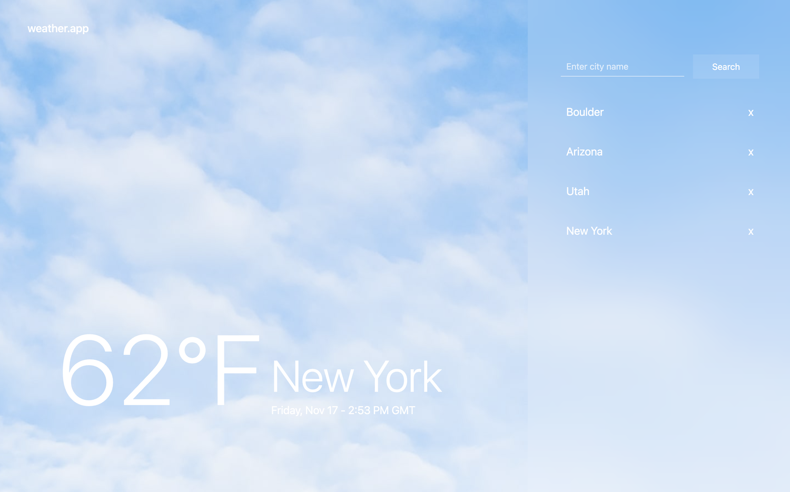

# Project: Live Weather app

### 📖 Description:
This is a simple weather app built with React and Redux. It uses the OpenWeatherMap API to fetch weather data for the searched city. The app also displays the weather for the default location if user's geolocation is enabled. The list of searched cities is stored in the Redux store and displayed in the sidebar.

👋 [DEMO](https://react-weather-app-evengenes-projects.vercel.app/)

### 🛠️ Built with:
- [React](https://reactjs.org/)
- [Redux](https://redux.js.org/) and [React Redux](https://react-redux.js.org/) for state management
- [OpenWeatherMap API](https://openweathermap.org/)
- [React Bootstrap](https://react-bootstrap.github.io/)
- [Axios](https://axios-http.com/)
- [SCSS](https://sass-lang.com/)

### 💻 How to run locally:
- Clone this repository
- Run `npm install` to install all dependencies
- Create a free account on https://openweathermap.org/
- Create a `.env` file in the root directory
- Add your OpenWeatherMap API key in the `.env` file as `REACT_APP_API_KEY=your_api_key`
- Run `npm start` to start the app
- Open http://localhost:3000 to view it in the browser.

###  🎉 Features:
- Search weather by city name
- Display the list of searched cities
- Display weather for the selected location
- Display weather for the default location (Bucharest, Romania)
- Remove an item from the list

### 💪Work in progress:

- Error handling for invalid API key (console error for now)
- Toggle between Celsius and Fahrenheit
- Responsive version

